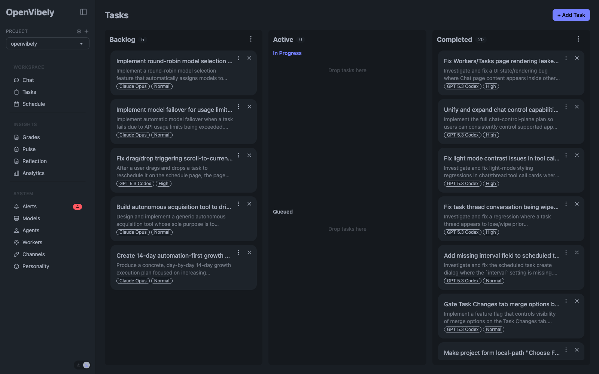

# OpenVibely

[](https://github.com/openvibely/openvibely/actions/workflows/test.yml)
[](https://codecov.io/github/openvibely/openvibely)
[](LICENSE)

The only recursive self-improvement command center for software teams.

OpenVibely turns one Chat into the control plane for your entire AI development workflow. Describe a goal once, then let it fan out into parallel task sessions, live agent execution, reviewable diffs, scheduled follow-ups, and durable project learning.

Agents do the work. You stay in command. Inspect any thread, review any diff, steer any task, and keep the whole plan moving from the original conversation.

Goal loops drive unfinished work forward. Memory Curator preserves project context. Skill Curator turns completed tasks into sharper reusable workflows. Every run can make the next one better, while your team stays in control.

Self-hosted, single binary, SQLite by default, and built for teams that want speed without giving up control, auditability, or ownership.

<a href="https://github.com/user-attachments/assets/377521fa-b117-476c-a52a-cfc10befb981">
  
</a>

## Documentation

Full user and operator documentation lives at <a href="https://docs.openvibely.ai" target="_blank" rel="noopener noreferrer">docs.openvibely.ai</a>.

Useful starting points:

- <a href="https://docs.openvibely.ai/features-overview" target="_blank" rel="noopener noreferrer">Features Overview</a>
- <a href="https://docs.openvibely.ai/quickstart" target="_blank" rel="noopener noreferrer">Quickstart</a>
- <a href="https://docs.openvibely.ai/first-time-setup" target="_blank" rel="noopener noreferrer">First-Time Setup</a>
- <a href="https://docs.openvibely.ai/deployment" target="_blank" rel="noopener noreferrer">Deployment</a>
- <a href="https://docs.openvibely.ai/configuration" target="_blank" rel="noopener noreferrer">Configuration</a>

## What OpenVibely Provides

| Capability | Product Outcome |
|---|---|
| Project workspaces | Keep repository context, model defaults, worker limits, schedules, memory, insights, and integrations tied to a real codebase. |
| Chat-first planning | Explore fuzzy ideas, attach context, create tasks, and orchestrate work from a project-aware conversation. |
| Task board execution | Queue coding work, stream progress, inspect logs and threads, review changed files, and decide what ships. |
| Reviewable changes | Use isolated Git worktrees and GitHub issue-to-PR workflows so AI output becomes visible diffs, pull requests, and review follow-ups rather than hidden edits. |
| Reusable agents | Capture system prompts, personalities, tools, skills, plugins, permissions, routing hints, and lifecycle behavior as reusable worker profiles. |
| Memory curation | Autonomously create, recall, update, and consolidate durable project memory so repeated context does not have to be re-explained. |
| Skill curation | Learn from completed work and improve reusable standalone or agent-owned skills for future tasks. |
| Automation Graphs | Build project-scoped graphs from schedules, Tasks and Agents, Native approvals, GitHub actions, and outcomes; save them into real resources and watch current state on the Live graph. |
| External channels | Create, monitor, and proactively message through Slack, Telegram, Discord, Email, GitHub, inbound webhooks, and the REST API. |
| Model providers | Run with Anthropic, OpenAI, Ollama, OpenAI-compatible Chat Completions providers, or Mixture of Models virtual configs that combine reference models through an aggregator. |
| Operations footprint | Self-host a single Go binary with SQLite by default, plus optional Docker/VPS and desktop modes. |
| Visibility and control | Use live status, execution logs, thread history, changed files, review comments, alerts, and insights to keep AI work auditable. |

## Quick Start (Recommended)

### Prerequisite

- Go `1.26.6+`

### Fresh Clone

For most users, setup is this fast:

```bash
git clone https://github.com/openvibely/openvibely.git
cd openvibely
./start.sh
```

Open `http://localhost:3001`.

## Optional Developer Workflow

Live reload while editing Go, templ, HTML, CSS, or JS files:

```bash
make install-tools
make dev
```

Open `http://localhost:3001`.

## First-Time In-App Setup

After startup:

1. Add at least one model in `/models`.
2. (Optional) Configure agents in `/agents`.
3. Create a project (local path or GitHub URL).
4. Create tasks in `/tasks` or orchestrate from `/chat`.
5. Configure `/workers` if you need tighter capacity control.

For the full UI-first walkthrough, see <a href="https://docs.openvibely.ai/quickstart" target="_blank" rel="noopener noreferrer">Quickstart</a> and <a href="https://docs.openvibely.ai/first-time-setup" target="_blank" rel="noopener noreferrer">First-Time Setup</a>.

## Configuration

Set environment variables directly or place them in `.env` (loaded by `start.sh`).

The full environment-variable reference now lives in [`docs/environment.md`](./docs/environment.md), including runtime paths, built-in auth, OAuth callbacks, integration bootstrap variables, Git SSL settings, and deployment examples.

For broader operator guidance, see <a href="https://docs.openvibely.ai/configuration" target="_blank" rel="noopener noreferrer">Configuration</a>, <a href="https://docs.openvibely.ai/authentication" target="_blank" rel="noopener noreferrer">Authentication</a>, and <a href="https://docs.openvibely.ai/deployment" target="_blank" rel="noopener noreferrer">Deployment</a>.

## UI User Guides

The published documentation at <a href="https://docs.openvibely.ai" target="_blank" rel="noopener noreferrer">docs.openvibely.ai</a> is the canonical user guide.

In-repo user guides are also available in [`docs/user-guides.md`](./docs/user-guides.md), including:

- Channels: Slack, Telegram, Discord, Email, GitHub, and outbound message targets
- Pages: Project Setup, Models, Agents, Workers, Tasks, Chat, Schedule, Automation Graphs
- Orchestration: task chains, swarm tasks, and Native or GitHub autonomous SDLC loops

## API and Swagger

Swagger UI:

- `http://localhost:3001/swagger/index.html` (when using `./start.sh`)

Example:

```bash
curl -X POST http://localhost:3001/api/chat/message \
  -F "message=Summarize the current task board" \
  -F "project_id=default"
```

See the <a href="https://docs.openvibely.ai/api-reference" target="_blank" rel="noopener noreferrer">API Reference</a> for details.

## Architecture: Shared Backend + Desktop Shell

OpenVibely uses a single Go backend for both deployment modes:

```text
cmd/
  server/             # Web/VPS/Docker entrypoint
  desktop/            # Wails desktop entrypoint
internal/
  config/             # Runtime config (server vs desktop mode)
  server/             # Reusable server bootstrap (Start → Instance)
  database/
  handler/
  llm/
  models/
  repository/
  service/
  testutil/
pkg/
start.sh
web/templates/
```

The `internal/server` package provides `Start(ctx, cfg) → (*Instance, error)` which wires the full backend (DB, repos, services, HTTP routes, workers, scheduler) and returns a running instance with its bound address and a shutdown handle.

- `cmd/server` uses `config.Load()` (server mode) and waits for OS signals.
- `cmd/desktop` uses `config.LoadWithMode(ModeDesktop)` which defaults to OS app-data directories for the DB, repos, and uploads, and binds to an ephemeral port. The Wails WebView loads the backend URL.

Both modes share 100% of the backend code; no forking.

## Running Modes

### Web Server (local / VPS / Docker)

```bash
./start.sh              # Simple local build + run
make install-tools      # One-time setup for live reload tooling
make dev                # Live reload while editing
make build && make run  # Explicit production-style build + run
```

Config is env-driven (`PORT`, `DATABASE_PATH`, `PROJECT_REPO_ROOT`, etc.). See [`docs/environment.md`](./docs/environment.md) for the full reference.

### Desktop App (Wails)

```bash
# Finder/Dock style app (no Terminal window)
make package-desktop-macos
open ./bin/OpenVibely.app

# Optional: direct binary run (from shell, shows terminal logs)
make build-desktop
./bin/openvibely-desktop
```

`OpenVibely.app` is the true desktop-launch experience on macOS. Running the raw `openvibely-desktop` executable from a shell is useful for debugging logs, but it will attach to Terminal.

Desktop mode defaults:

| Setting | Desktop default | Env override |
|---|---|---|
| Port | `0` (ephemeral) | `PORT` |
| DB path | Platform app-data directory (`~/Library/Application Support/OpenVibely` on macOS, `%LOCALAPPDATA%\OpenVibely` on Windows, `$XDG_DATA_HOME/openvibely` on Linux) | `DATABASE_PATH` or `OPENVIBELY_APP_DATA_DIR` |
| Repo root | `<platform app-data directory>/repos` | `PROJECT_REPO_ROOT` or `OPENVIBELY_APP_DATA_DIR` |
| Local repo paths | enabled | `OPENVIBELY_ENABLE_LOCAL_REPO_PATH` |

Desktop user data is stored outside the replaceable application install unit in the OS application-data directory. Updates and rollbacks replace only the signed OpenVibely `.app` bundle on macOS or desktop executable on Windows/Linux; databases, projects, memories, skills, agents, configuration, credentials, plugins, and other user data are never copied, replaced, deleted, or rolled back. All storage environment variables still work as explicit external overrides in desktop mode, but must resolve outside the install and backup boundaries.

### Docker

The default image is designed for the complete OpenVibely workflow:

| Image definition | Purpose | Contents |
|---|---|---|
| `Dockerfile` | Published OpenVibely server and coding-agent image | Fedora-based runtime with Go, Node.js/npm/Corepack/TypeScript, Python/pip/venv, Rust/cargo, Java/JDK, Ruby, Git, ripgrep, and native build tools |
| `Dockerfile-dev` | Developing OpenVibely itself | Live-reload environment with the repository source, Air, templ, Swagger, Go, Node.js, and rootless Podman |

The server executes coding agents in the same image, so `openvibely/openvibely` includes the language runtimes and build tools those agents need. Build and verify it with:

```bash
make docker-build
make docker-check-tools
```

The image runs as UID/GID `10001:10001`, so mounted `/data` storage must be writable by that user. See <a href="https://docs.openvibely.ai/deployment" target="_blank" rel="noopener noreferrer">Deployment</a> for storage setup and upgrade guidance, and [`docs/environment.md`](./docs/environment.md) for runtime configuration.

## OAuth by Mode

- **Server mode (VPS)**: Set `APP_BASE_URL` to your public origin. OAuth callbacks route to your hostname.
- **Desktop mode**: OAuth defaults to localhost callback flow. `APP_BASE_URL` is typically unset; the backend binds to `127.0.0.1` with an ephemeral port and OAuth providers redirect back to localhost.
- **Troubleshooting**: If provider rejects localhost callbacks, set `OAUTH_REDIRECT_MODE=localhost_manual` and paste the callback URL manually.

## Development

```bash
go test ./... -count=1 -timeout 60s
make build
```

Common targets:

- `make dev`
- `make build`
- `make build-desktop`
- `make templ`
- `make swagger`
- `make run`
- `make clean`

## For AI Agents

Repository-specific guidance is app-managed under `.openvibely/` instead of root instruction markdown. Use the project skill index at `.openvibely/skills/SKILLS.md` and managed memory index at `.openvibely/memories/MEMORIES.md` through OpenVibely's normal skill and memory tooling.

## License

MIT
